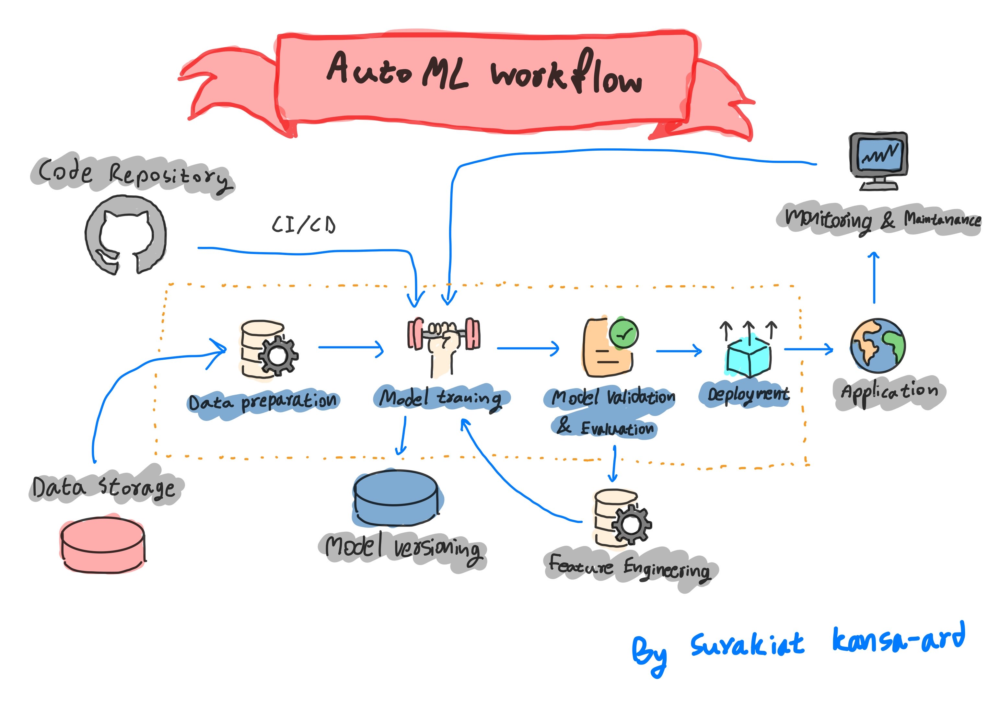

# AutoML System: Telco Customer Churn Prediction

## Overview
This project implements a fully-automated machine learning (AutoML) pipeline to predict customer churn in a telecommunications company using the Telco Customer Churn dataset. The AutoML pipeline simplifies the process of data cleaning, feature engineering, model selection, hyperparameter tuning, and evaluation.

---
## Project Workflow Architecture



---

## Goals
- Develop an automated pipeline capable of efficiently predicting customer churn.
- Enable rapid experimentation and deployment of different ML models.
- Reduce manual data science tasks and optimize business decisions through automation.

## Dataset
The dataset used in this project is **Telco Customer Churn**, sourced from IBM:
- Approximately 7,000 customer records.
- Features include customer demographics, service usage, contract details, and payment methods.
- Target variable (`Churn`) indicates whether a customer has stopped using the service.

[Download the Dataset](https://www.kaggle.com/datasets/blastchar/telco-customer-churn)

## Project Structure

```
automl-system/
├── data/
│   ├── raw/
│   │   └── WA_Fn-UseC_-Telco-Customer-Churn.csv
│   └── processed/  ← Automatically saved preprocessed data
│
├── automl/
│   ├── config.py               ← Load config
│   ├── preprocessing.py        ← Data preprocessing
│   ├── feature_engineering.py  ← Select important features
│   ├── model_selector.py       ← Train & evaluate multiple ML models
│   ├── tuner.py                ← Hyperparameter tuning (Optuna)
│   ├── evaluator.py            ← Evaluate model and create reports
│   ├── exporter.py             ← Save model & metrics
│   ├── pipeline.py             ← Combines all steps into one pipeline
│   └── __init__.py             ← Makes the folder a Python package
│
├── notebooks/
│   ├── 01_eda.ipynb            ← Exploratory Data Analysis (EDA)
│   └── 02_debug_pipeline.ipynb ← Interactive notebook to debug & evaluate pipeline
│
├── scripts/
│   └── run_automl.py           ← CLI to easily run AutoML pipeline
│
├── models/                     ← Saved trained models
├── reports/                    ← Evaluation reports and metrics
├── tests/                      ← Unit tests
│
├── config.yaml                 ← Pipeline and modeling parameters
├── requirements.txt
├── README.md
└── .gitignore
```

## Workflow & Pipeline Steps

### 1. **Extract, Transform, Load (ETL)**
- Raw dataset is loaded, cleaned, encoded, and scaled.
- Processed data is saved for reproducibility (`data/processed/`).

### 2. **Exploratory Data Analysis (EDA)**
- Analysis performed in `01_eda.ipynb`.
- Visualizes distributions, correlations, and feature importance.

### 3. **Feature Engineering**
- K-best feature selection method is used to optimize performance and reduce noise.

### 4. **ML Model Selection & Hyperparameter Tuning**
- Trains multiple models: Logistic Regression, Random Forest, XGBoost.
- Optionally performs hyperparameter tuning with Optuna.

### 5. **Model Evaluation**
- Evaluates model accuracy, F1-score, and confusion matrix.
- Generates and saves detailed evaluation reports.

### 6. **Pipeline Automation**
- Uses scikit-learn pipelines to modularize and automate ML tasks.

## Running the Project

### Set up Python Environment
```bash
python -m venv venv
source venv/bin/activate  # macOS/Linux
venv\Scripts\activate     # Windows
pip install -r requirements.txt
```

### Run AutoML Pipeline (CLI)
```bash
python scripts/run_automl.py --config config.yaml
```

### Interactive Exploration (Notebook)
```bash
jupyter notebook
# Open 02_debug_pipeline.ipynb
```

## Results & Findings
- Best model automatically selected based on cross-validation results.
- Evaluation metrics clearly highlight the model's predictive capability.

## Conclusion
- AutoML significantly streamlines predictive modeling.
- Achieved effective churn prediction with minimal manual intervention.

## Future Work
- Enhance with real-time prediction capabilities using FastAPI.
- Add SHAP/LIME for model explainability.
- Integrate external datasets (e.g., economic factors).

## Contribution
Feel free to fork this repository and make improvements or suggest changes.

---

**Happy Machine Learning!**

---

## Project Author

| Name           | Contact Information                                                  |
|----------------|----------------------------------------------------------------------|
| **Surakiat P.** |                                                                      |
| 📧 Email       | [surakiat.0723@gmail.com](mailto:surakiat.0723@gmail.com)   |
| 🔗 LinkedIn    | [linkedin.com/in/surakiat](https://www.linkedin.com/in/surakiat-kansa-ard-171942351/)     |
| 🌐 GitHub      | [github.com/SurakiatP](https://github.com/SurakiatP)                 |


